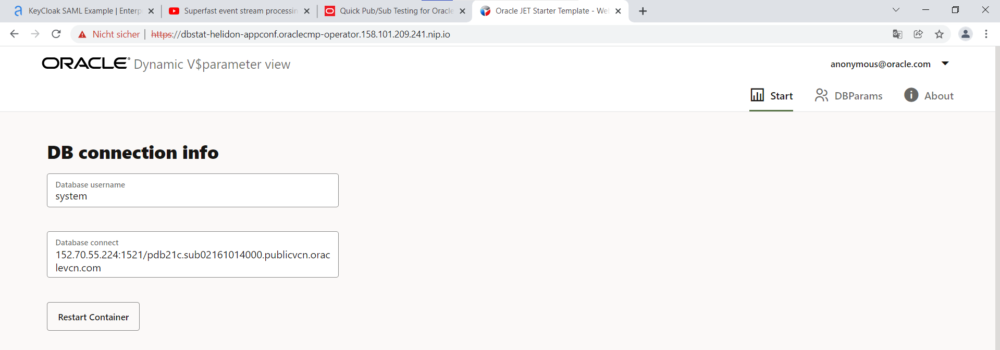
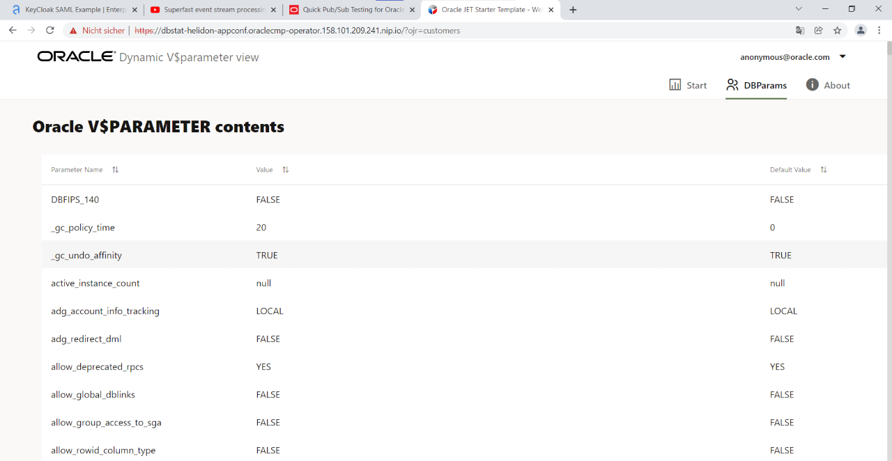
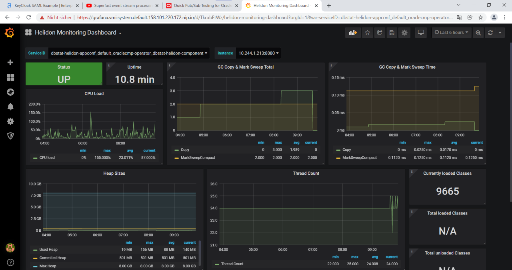
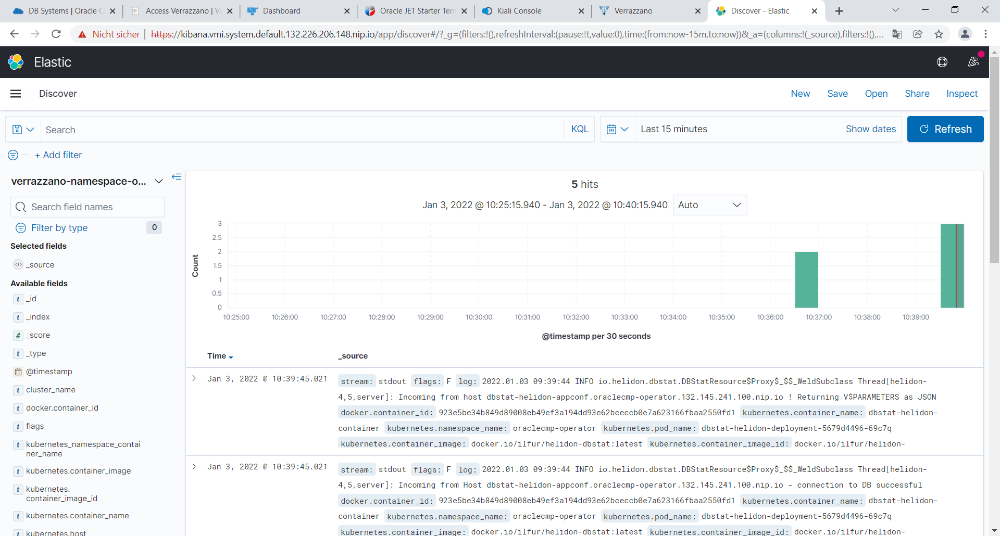
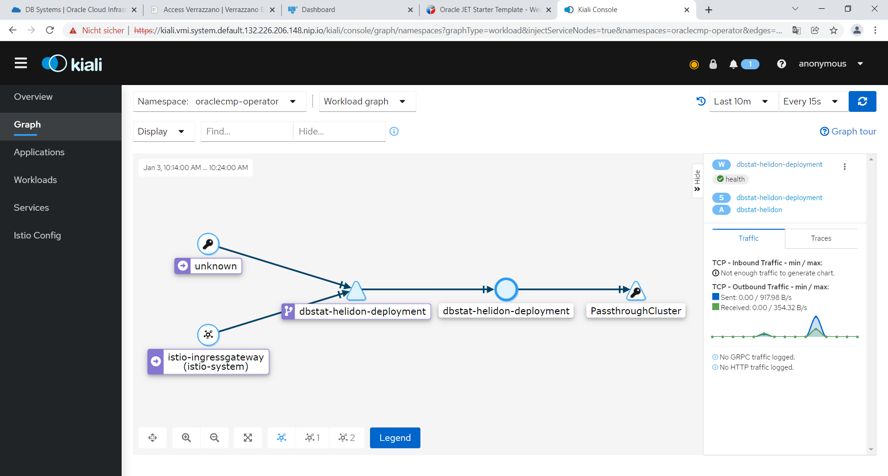
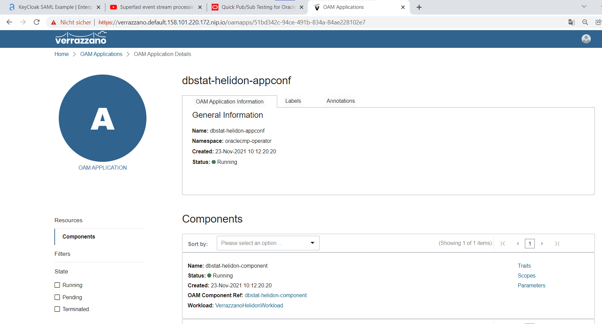

# dbstat_helidon
A simple java and javascript application written with Helidon (REST services) and JET (JavaScript UI).
The application connects to an Oracle Database and reads and displays the database's V$parameters view.
Privileged Database access (sysdba role, sys or system user) is required.

This application can be used to testify the OracleCMP Operator for Kubernetes (https://github.com/ilfur/k8s_operator_cloudmgmtpack), but also to showcase the difference between a plain Kubernetes Deployment and a Verrazzano Deployment.
There are two Deployments available for this application: 
One Deployment for a typical Kubernetes Cluster which defines a Secret, a Service and a Container/POD Deployment.
The other Deployment defines a Verrazzano Application (a plain Kubernetes Cluster with Verrazzano installation required) which includes Logging with ElasticSearch, SSL Access to a Load Balancer using Istio and cert-manager, Monitoring with Prometheus/Grafana, Network Visualisation with Istio and Kiali.

## To install the application:
### 1) In the plain, regular way
* clone the project to You local drive and hop into the "helidon-db-status" subdirectory
git clone https://ilfur/dbstat_helidon
cd helidon-db-status

* In a regular Kubernetes Cluster, create a new namespace, say "dbstat-helidon"
kubectl create namespace dbstat-helidon

* In that namespace, create a new Secret to access an existing Oracle Database as user "system"
kubectl create secret generic db-user-pass \
   --from-literal=pdb_admin=system \
   --from-literal=pdb_pwd='mypassword' \
   --from-literal=pdb_conn='192.168.10.123:1521/mypdb' \
   -n dbstat-helidon
   
* In that same namespace, create a new ConfigMap holding the Connect String to the Oracle Database.
This is redundant to the previously created secret, but a good test, showcase and demo to do so.
kubectl apply -f configmap.yaml

* Now, do the deployment of the Container itself into that same namespace and register the network service to access the Container through port 8080. There is no need to compile the recently cloned project, since the Container is pre-built and available on docker.io
kubectl apply -f app.yaml

* When the Deployment is up and running, i.e. Pod is downloaded and started correctly, try to access the application through a browser, using the Worker Node's IP address and port 8080. You should see a start screen with the Connection Information pointing to Your database or whatever is specified in the prior secret and the configmap.

When Clicking on the "DBParams" Tab on the right, a REST call is issued against the application container that does actually connect to the database and read the v$parameters system view. If nothing shows up, have a look at the application log. Probably, the database canot be reached or a SID was used instead of a Service name...

### 3) the "Verrazzano" way
* (same as in 1.) clone the project to You local drive and hop into the "helidon-db-status" subdirectory
git clone https://ilfur/dbstat_helidon
cd helidon-db-status

* (same as in 1.) In a regular Kubernetes Cluster, create a new namespace, say "dbstat-helidon"
kubectl create namespace dbstat-helidon

* (same as in 1.) In that namespace, create a new Secret to access an existing Oracle Database as user "system"
kubectl create secret generic db-user-pass \
   --from-literal=pdb_admin=system \
   --from-literal=pdb_pwd='mypassword' \
   --from-literal=pdb_conn='192.168.10.123:1521/mypdb' \
   -n dbstat-helidon
   
* (same as in 1.) In that same namespace, create a new ConfigMap holding the Connect String to the Oracle Database.
This is redundant to the previously created secret, but a good test, showcase and demo to do so.
kubectl apply -f configmap.yaml

* Now, instead of defining deployments, services, .... separately, lets define one (or most often several) application component
kubectl apply -f vz_comp.yaml
This vz_comp.yaml basically defines a kubernetes deployment using the prebuilt container that is also used in the prior example. It also uses a "VerrazzanoHelidonWorkload" type, which specifies several things, among those the way how log output is gathered from the container. Don't forget, this is an extension to the basic Kubernetes yaml Syntax, but this extension is standardized, using the "Open Application Model" specification.

* Now, add the component that was just defined to an application, specifying more endorsed features like a load-balanced ingress and prometheus metric support. Those endorsed Features are called "Traits" in the Open Application Model spec.
kubectl apply -f vz_app.yaml

The sample application will be reachable through the browser, just as in th prior basic deployment. But now, Verrazzano will have also created:
#### Networking
* a (global) DNS entry for Your application, depending on the DNS service configured whe installing Verrazzano
* a SSL certificate for the new DNS host entry using cert-manager
* a software load balancer through an Istio Ingress definition
* since going through Istio, network monitoring and visualisation is enabled through Kiali
#### Monitoring
* a Prometheus scraping definition
* standard Grafana Dashboards for Helidon (and others) - the Helidon Framework in use offers metric support for custom metrics 
#### Logging
* a side car, an additional container with "fluentd" in it which is attached to the application container and sends all log information to a pre-installed ElasticSearch Engine
* a new log is populated to Elasticsearch for each kubernetes namespace in use. Just create a new Index on top of a new log if not used before and You can see all e.g. StdOut logs entries immediately
#### More
* Single SignOn could be done through the pre-installed KeyCloak by SAML, JWT and other mechanisms. The Application would need to check that, it's not part of Verrazzano. The Verrazzano Monitoring and Admin UI's are using Keycloak SSO themselves, though.
* Tracing and traces Monitoring through Jaeger and Opentracing API in the Aplication are not yet part of Verrazzano, but could be easily installed and used on top of what is already there.

So in addition to just using the application through a network as specified in the first example, some more applications can be used on-the-fly for in-depth views to the application.

